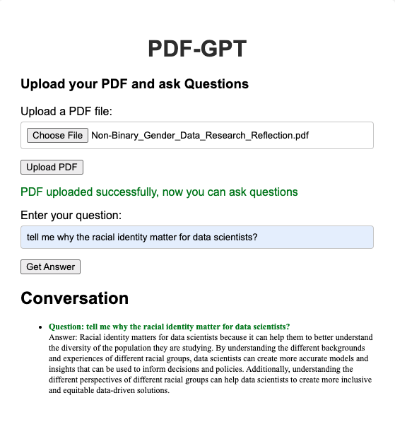

# PDF-GPT

PDF-GPT is a web application that uses OpenAI's GPT to extract and process information from PDF files. The application is built using Flask and can be deployed using Docker and Azure.

The final webapp is in [here](https://pdf-gpt.azurewebsites.net/)

*note: 
    1. you need to get your OpenAI API keys from [OpenAI](https://platform.openai.com/account/api-keys). Read more about how to get the OpenAI API keys from [windowscentral](https://www.windowscentral.com/software-apps/how-to-get-an-openai-api-key)

## Developing map

## Features

- Upload and process PDF files
- Extract text from PDF files
- Use GPT to search and process the extracted text
- Display processed information on the web interface

## Requirements

- Docker
- Python 3.9+
- Azure CLI (for deployment)

## Local Setup

1. Clone the repository:
> git clone https://github.com/yourusername/721Final_project_Scott_Lorna.git

> cd 721Final_project_Scott_Lorna

2. Create an `env.list` file in the project directory with your API keys:
> PINECONE_API_KEY=<your_pinecone_api_key>
> PINECONE_API_ENV=<your_pinecone_api_env>

* working with Pinecone
Pinecone is a vector database service that helps to store and process the information extracted from the PDF files in a more efficient and scalable manner. The application interacts with Pinecone using the API key and environment value provided during the Pinecone account setup.

* To integrate Pinecone in the application, you'll need to:

    1. Sign up for a Pinecone account and obtain the API key and environment value.
    2. Add the API key and environment value to the `env.list` file.
    3. Update the application code to interact with Pinecone's vector storage system for processing and storing extracted information.

    For more information on working with Pinecone, refer to their official documentation.

* Set up Pinecone API Key and Environment: After signing up, you'll receive an API key and environment value. Add these to your env.list file:

3. Build the Docker image:
> docker build -t pdf-gpt .

4. Run the application using Docker:
> docker run -p 5000:5000 --env-file env.list pdf-gpt

5. Open your browser and navigate to `http://localhost:5000`.

## Deployment to Azure

1. Log in to Azure:
> az login

2. Create a resource group and a web app:
> az group create --name pdf-gpt_group --location <location>

> az appservice plan create --name pdf-gpt-plan --resource-group pdf-gpt_group --sku B1 --is-linux

> az webapp create --resource-group pdf-gpt_group --plan pdf-gpt-plan --name pdf-gpt --deployment-container-image-name <your_docker_image>

3. Set environment variables in Azure:
> az webapp config appsettings set --resource-group pdf-gpt_group --name pdf-gpt --settings PINECONE_API_KEY=<your_pinecone_api_key>

> az webapp config appsettings set --resource-group pdf-gpt_group --name pdf-gpt --settings PINECONE_API_ENV=<your_pinecone_api_env>

> az webapp config appsettings set --resource-group pdf-gpt_group --name pdf-gpt --settings WEBSITES_PORT=5000
